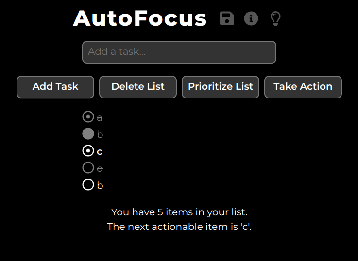

# PWA AutoFocus App

You can try this app out by visiting https://avidrucker.github.io/pwa-autofocus-app/

## About AutoFocus

AutoFocus is the name of an algorithm used for improving one's focus and productivity. It was designed by Mark Forster, and you can read more about Mark and AutoFocus [here](http://markforster.squarespace.com/blog/2021/11/16/the-final-version-perfected-fvp-instructions-reposted.html).

Here is a flow chart diagram that describes what one can do with an AutoFocus list at any time: [AutoFocus flow chart diagram gist](https://gist.github.com/avidrucker/0c937921ec94d9ac4e208b26d3917020)

This app was carefully crafted to adhere as closely as possible to AutoFocus principles, while adding some digital conveniences (saving, loading, etc..) You can add new items to the list, prioritize the list, and take action on the list. Crossing off items as well as copying items is also supported.

## App Features

- Dark and light modes
- SVG Icons (Font Awesome 4)
- Sharable lists via browser link
- Export to JSON, import from JSON
- Import from raw text
- Session data via local storage
- List conflict resolution
- Keyboard accessibility

## Available Scripts

In the project directory, you can run:

- `npm start`: Runs the app locally
- `npm test`: Runs the test suites
- `npm run build`: Creates a hostable production build of AutoFocus

## Tech Stack

- ReactJS library and [Create React App](https://github.com/facebook/create-react-app) starter template
- [Tachyons](https://tachyons.io/) utility CSS library
- JavaScript
- React Testing Library and Jest for testing
- Font Awesome 4 SVG icons
- Some elbow grease
